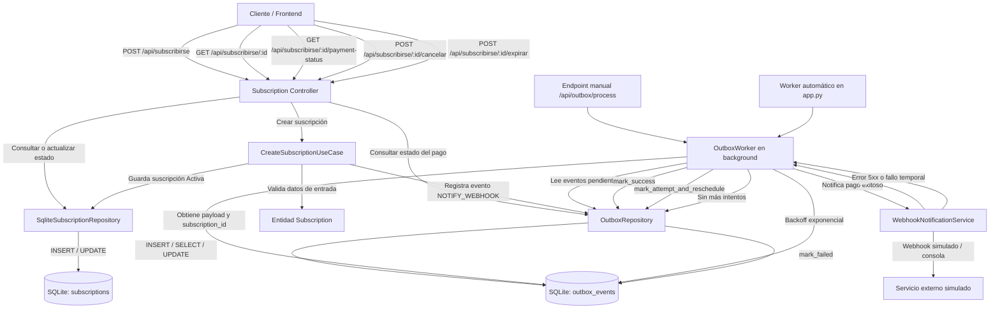

# Diagrama de Arquitectura Backend

Este diagrama muestra el flujo principal de datos del backend para la creación de suscripciones,
la persistencia del estado, el patrón outbox y la notificación al servicio externo con reintentos.

## Lectura Rápida

1. El cliente envía una solicitud al controller de suscripciones.
2. El controller delega la creación al caso de uso.
3. El caso de uso guarda la suscripción en SQLite y registra un evento en el outbox.
4. El `OutboxWorker` procesa eventos pendientes en segundo plano.
5. El worker llama al servicio externo simulado para notificar el pago exitoso.
6. Si la notificación falla, se aplican reintentos con backoff exponencial.
7. El frontend consulta el estado del pago mediante el endpoint `payment-status`.

## Decisiones Reflejadas en el Diagrama

- Separación en capas: controller, caso de uso, repositorios e infraestructura externa.
- Persistencia de estados de suscripción en SQLite.
- Uso de patrón outbox para desacoplar la notificación externa.
- Resiliencia mediante reintentos y reprogramación de eventos fallidos.
- Soporte para procesamiento automático y manual del outbox en pruebas o demos.

## Nota de Diseño

La implementación actual registra la suscripción y el evento outbox en pasos consecutivos.
Como mejora de producción, ambos pasos deberían ejecutarse dentro de una transacción atómica
para evitar inconsistencias si la base de datos falla entre ambas operaciones.
