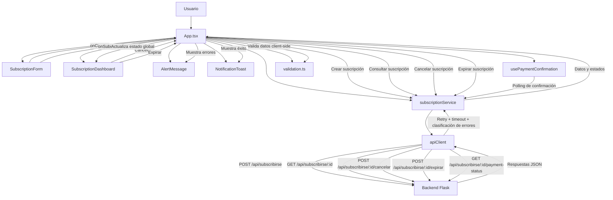

# Diagrama de Flujo Frontend

Este diagrama muestra la estructura principal del frontend en `React + TypeScript`,
la relación entre componentes, hooks y servicios, y la comunicación con el backend.

## Lectura Rápida

1. `App.tsx` coordina el estado principal de la aplicación.
2. `SubscriptionForm` captura los datos del usuario.
3. Antes de enviar, `validation.ts` valida nombre, email y método de pago.
4. `subscriptionService` centraliza el acceso a la API.
5. `apiClient` encapsula `fetch`, timeout, reintentos y clasificación de errores.
6. Tras crear la suscripción, `usePaymentConfirmation` consulta el estado del pago inicial mediante polling.
7. `SubscriptionDashboard` muestra los datos persistidos, el estado de la suscripción y la confirmación del pago.
8. `AlertMessage` y `NotificationToast` manejan el feedback visual al usuario.

## Responsabilidades Reflejadas

- `App.tsx`: orquestación del flujo principal y estado compartido.
- `components/`: presentación de formulario, dashboard y mensajes.
- `hooks/`: lógica de polling para confirmación del pago.
- `services/`: comunicación con backend y manejo técnico del HTTP.
- `utils/`: validación client-side.
- `types/`: contratos TypeScript del dominio frontend.

## Decisiones Técnicas

- Se separó la vista de la infraestructura HTTP mediante una capa de servicios.
- La confirmación del pago inicial se resolvió con polling para mantener la solución simple y demostrable.
- Los errores se clasifican en validación, servidor, timeout y red para dar mensajes más claros.
- La UI consume el estado real del backend en lugar de simularlo localmente.
